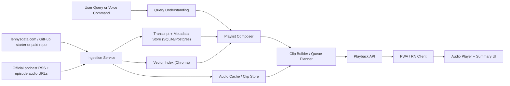

# Lenny Executive Clips - Technical Architecture

## Goal

Ship the fastest local-testable MVP for the driving scenario:

1. User says or taps `Hi Lenny`
2. User asks for a topic like `Growth cold start clips`
3. System assembles a 10-25 minute playlist from original Lenny audio
4. Playback starts in under 3 seconds once assets are ready locally
5. User controls playback with a tiny set of voice commands

This architecture is optimized for `speed to local demo`, not maximum elegance.

## Data Source Reality

Confirmed source facts:

- `lennysdata.com` offers a starter pack with `10 newsletter posts and 50 podcast episodes`, and paid access offers the full archive plus a private GitHub repo and automatic transcript updates.
- The public starter GitHub repo includes `index.json`, `newsletters/`, and `podcasts/` in markdown form.
- The public transcript files contain rich frontmatter plus timestamped speaker-attributed text.

Implication:

- `lennysdata.com` is the right source of truth for `transcripts + metadata + newsletter text`.
- It is not, by itself, the full audio delivery layer for the MVP described in the PRD.
- We should use `lennysdata.com` for understanding and retrieval, then join it with official podcast audio from the public podcast RSS / episode audio URLs.

This join is the critical ingestion step.

## Recommended MVP Shape

Build the MVP as 4 local services plus 1 mobile/web client:

1. `Ingestion Pipeline`
2. `Retrieval + Playlist Composer`
3. `Clip Builder`
4. `Playback API`
5. `Client App`

For local testing, use a `web/PWA first` client before investing in CarPlay / Android Auto.

## Architecture Overview



## Fastest Viable Stack

### Client

- `Next.js` or `Vite` PWA for the first local demo
- Why:
  - quickest path to a testable UI
  - easier local debugging than React Native from an empty repo
  - enough to validate the core flow before car integrations

### Backend

- `Python + FastAPI`
- Why:
  - easiest for transcript parsing, embeddings, ffmpeg orchestration, and local ML glue
  - good fit with LlamaIndex / Chroma / whisper-style tooling

### Storage

- `SQLite` for metadata and playlist/session logs
- `Chroma` for semantic retrieval
- local filesystem for raw audio, clip cache, and summaries

### Audio Processing

- `ffmpeg`
- store:
  - raw episode audio
  - derived clip audio files
  - waveform / duration metadata

### Voice

- local push-to-talk first
- optional wake word second
- `faster-whisper` for STT

### Retrieval / Reasoning

- first pass: embedding retrieval + lightweight rules
- LLM only for:
  - query normalization
  - theme mapping
  - concise summaries
  - wrap-up text

Avoid a heavy reasoning loop in v1. The value comes from strong curation and clean playback, not agent complexity.

## Core Data Model

### `episodes`

- `episode_id`
- `title`
- `guest`
- `published_at`
- `description`
- `source_markdown_path`
- `audio_url`
- `audio_local_path`
- `duration_sec`
- `transcript_status`

### `transcript_segments`

- `segment_id`
- `episode_id`
- `speaker`
- `start_sec`
- `end_sec`
- `text`
- `tokens`
- `embedding_id`

### `themes`

- `theme_id`
- `name`
- `name_normalized`

Seed with:

- `product`
- `growth`
- `ai`
- `productivity`
- `leadership`
- `career`

### `clip_candidates`

- `clip_id`
- `episode_id`
- `start_sec`
- `end_sec`
- `title`
- `theme`
- `subtopic`
- `score`
- `summary_short`
- `summary_long`
- `source_segment_ids`

### `playlists`

- `playlist_id`
- `query`
- `theme`
- `subtopic`
- `duration_target_sec`
- `duration_actual_sec`
- `status`

### `playlist_items`

- `playlist_item_id`
- `playlist_id`
- `clip_id`
- `position`

## Ingestion Design

### Step 1: Sync transcript corpus

Input:

- public starter GitHub repo for free testing
- paid private repo later without changing schema

Process:

1. Pull `index.json`
2. Read `podcasts/*.md`
3. Parse frontmatter
4. Parse transcript body into timestamped speaker segments

Output:

- normalized episode records
- normalized transcript segments

### Step 2: Resolve audio

Input:

- official podcast RSS feed / episode pages

Process:

1. match transcript episode title to RSS item title
2. store `audio_url`
3. download audio on demand or prefetch top episodes

Output:

- local mp3/m4a file per episode

### Step 3: Build clip candidates

Process:

1. chunk transcript into natural windows
2. score windows for:
   - density of actionable insight
   - theme relevance
   - self-containedness
   - low overlap with other windows
3. produce 60-180 second candidate clips
4. generate short summary for each clip

This should be a repeatable batch job, not runtime work.

## Retrieval and Playlist Composition

### Query Understanding

Input examples:

- `Growth cold start clips`
- `Give me product prioritization`
- `Switch to AI`
- `Explain more`

Output shape:

```json
{
  "intent": "start_playlist",
  "theme": "growth",
  "subtopic": "cold start",
  "duration_minutes": 18
}
```

Rules:

- map to one of 6 themes first
- extract subtopic second
- infer target duration third
- never ask follow-up questions in the driving path unless confidence is very low

### Playlist Composer

Ranking inputs:

- semantic similarity to query
- explicit theme match
- clip quality score
- freshness bonus
- diversity penalty for same episode repetition
- adjacency bonus for coherent transitions

Composition constraints:

- 6-12 clips
- each clip 60-180 sec
- 10-25 minute total
- max 2 clips per episode unless exceptional
- no near-duplicate idea back-to-back

### `Explain more`

Fast-path interpretation:

- fetch an adjacent or topically related clip from the same episode if possible
- otherwise insert a tightly related clip from another episode
- also show expanded text summary on screen

This avoids real-time generative audio.

## Audio Strategy

The PRD requires original Lenny audio only, so runtime TTS should not be on the main playback path.

Recommended split:

- playlist body: `original episode audio clips only`
- assistant confirmations:
  - for local MVP, use a short UI text banner and optional simple earcon
  - if spoken confirmations are needed later, record a small fixed set of human voice prompts manually

This keeps the product faithful to the zero-synthetic-audio constraint.

## Runtime Request Flow

### `Start playlist`

1. user speaks or types request
2. STT converts speech to text
3. query parser maps to theme + subtopic
4. composer fetches a prebuilt clip list
5. playback API returns:
   - playlist metadata
   - first clip URL
   - summaries
6. client starts playback immediately
7. rest of queue streams or preloads in background

### `Next / Previous / Repeat / Stop`

- handled entirely on the client plus a lightweight session API

### `Change topic`

- starts a fresh query parse and new playlist generation

## Performance Plan

To hit `< 3s` perceived startup:

- precompute embeddings
- precompute clip candidates
- precompute summaries
- cache popular theme playlists locally
- preload first 2 clips for each top theme
- treat runtime as `selection`, not `generation`

Runtime generation should be limited to:

- intent parse
- ranking
- queue assembly

## Offline Plan

For local demo:

- bundle metadata and selected clips locally
- allow playlist playback without network once downloaded

For post-MVP:

- let users download 1-2 themes for offline use
- background refresh transcripts and metadata when online

## API Surface

### `POST /api/ingest/sync`

- sync transcripts, metadata, and audio mappings

### `POST /api/playlists`

Request:

```json
{
  "query": "Growth cold start clips"
}
```

Response:

```json
{
  "playlist_id": "pl_123",
  "theme": "growth",
  "subtopic": "cold start",
  "duration_sec": 1120,
  "items": [
    {
      "clip_id": "clip_1",
      "audio_url": "/audio/clips/clip_1.mp3",
      "summary_short": "Cold start is mostly an activation problem, not just acquisition."
    }
  ]
}
```

### `POST /api/commands`

- `next`
- `previous`
- `repeat`
- `stop`
- `change_topic`
- `explain_more`

### `GET /api/themes`

- returns the fixed 6-theme taxonomy

## Build Order

### Phase A: local content engine

- ingest starter repo
- map episodes to audio
- create 50-100 usable clip candidates
- expose `/api/playlists`

### Phase B: local player

- now playing UI
- summary card
- queue controls
- microphone / text input

### Phase C: reliability

- better ranking
- better clip boundaries
- caching
- telemetry

## Biggest Risks

### 1. Audio mapping mismatch

Transcript titles and RSS titles may not always align cleanly. Build a fuzzy matching layer with manual override support.

### 2. Clip quality

This is the real product moat. Bad clip boundaries will make the experience feel stitched together and low quality.

### 3. Wake word complexity

Do not block MVP on a true always-listening wake word. Use push-to-talk first.

### 4. Car mode

Leave CarPlay / Android Auto until the core playlist loop is proven on phone and web.

## Recommended Local-Test Cut

If speed matters most, ship this exact slice first:

- dataset: public starter pack only
- topics: all 6, but only 2-3 strong subtopics each
- client: desktop/mobile web PWA
- commands: text + microphone button
- audio: predownload top 10 episodes only
- playlists: build from precomputed clips, not dynamic ffmpeg at request time

That is the fastest path from zero to a believable local demo.

## Sources

- [Lenny's Data](https://www.lennysdata.com/)
- [Public starter repo README](https://github.com/LennysNewsletter/lennys-newsletterpodcastdata)
- [Starter repo index.json](https://raw.githubusercontent.com/LennysNewsletter/lennys-newsletterpodcastdata/main/index.json)
- [Sample podcast transcript markdown](https://raw.githubusercontent.com/LennysNewsletter/lennys-newsletterpodcastdata/main/podcasts/amol-avasare.md)

